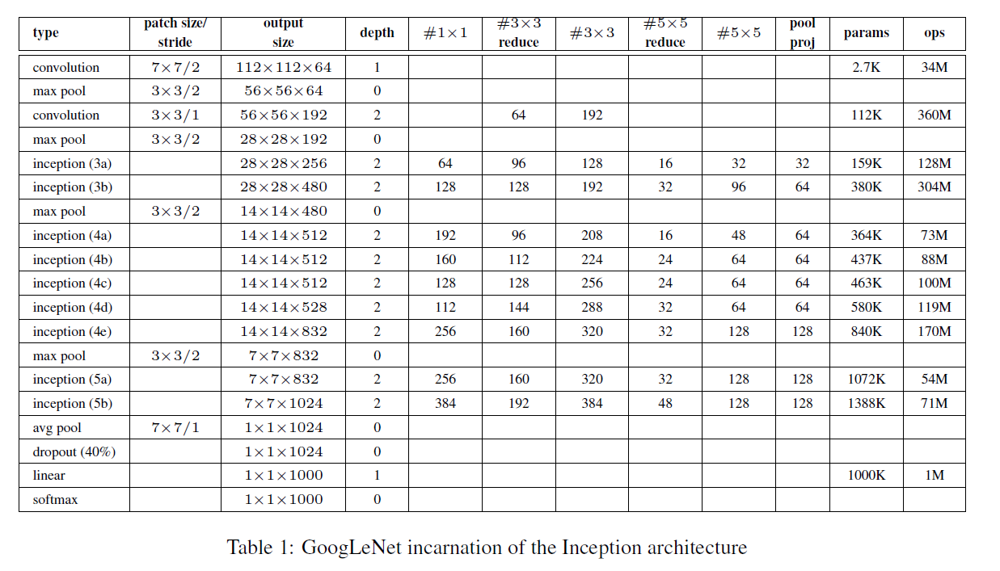

# Inception Net Implementation from Scratch using PyTorch

This repository contains an implementation of the Inception Network (GoogleNet) from scratch using PyTorch. The Inception architecture is a type of convolutional neural network (CNN) that was originally proposed by Szegedy et al. in the paper ["Going Deeper with Convolutions"](https://arxiv.org/abs/1409.4842).



## Overview

The Inception architecture introduces a novel approach to convolutional neural networks, where multiple types of convolutional layers (1x1, 3x3, 5x5) and pooling layers are used in parallel in each block. This allows the network to capture features at different scales, leading to improved performance on image classification tasks.

### Model Architecture

Below is a simplified diagram of the Inception Block, which is the core component of the network:


The full network is composed of several such blocks stacked together:

1. **Initial Convolutional Layer:** A basic convolutional layer to process the input image.
2. **Inception Blocks:** A series of Inception Blocks that progressively extract features.
3. **Pooling Layers:** Max pooling layers to reduce the spatial dimensions.
4. **Fully Connected Layer:** A final fully connected layer for classification.

### Code Structure

- **ConvBlock:** A basic convolutional block consisting of a convolutional layer followed by batch normalization and ReLU activation.
- **InceptionBlock:** Implements the Inception module, combining 1x1, 3x3, 5x5 convolutions, and max pooling in parallel.
- **Inception:** The full Inception network, combining multiple Inception blocks.

## Installation

To run this code, you need to have Python and PyTorch installed. You can install the required libraries using:

```bash
pip install torch
```

## Usage

To test the network, you can run the `main()` function in the `inception_net.py` file. The `main()` function initializes the network, creates a random input tensor, and prints the output size.

```bash
python inception_net.py
```

Example Output

```python
y.size() = torch.Size([3, 10])
```

## Customization

You can customize the architecture by modifying the parameters of the Inception blocks in the `Inception` class. For example, you can change the number of output channels for each convolutional path to adjust the capacity of the network.

## Training the Model

This implementation is designed as a template. You can integrate it into your training pipeline by adding a dataset, loss function, and optimizer. Here's a simple example:

```python
# Example Training Loop
import torch.optim as optim

# Initialize model, loss function, and optimizer
model = Inception(3).to(device)
criterion = nn.CrossEntropyLoss()
optimizer = optim.Adam(model.parameters(), lr=0.001)

# Training loop
for epoch in range(num_epochs):
    for data in train_loader:
        inputs, labels = data
        inputs, labels = inputs.to(device), labels.to(device)

        optimizer.zero_grad()

        outputs = model(inputs)
        loss = criterion(outputs, labels)
        loss.backward()
        optimizer.step()

    print(f'Epoch {epoch+1}, Loss: {loss.item()}')
```

## References

Szegedy, C., Liu, W., Jia, Y., Sermanet, P., Reed, S., Anguelov, D., ... & Rabinovich, A. (2015). Going deeper with convolutions. In Proceedings of the IEEE conference on computer vision and pattern recognition (pp. 1-9).
["Going Deeper with Convolutions"](https://arxiv.org/abs/1409.4842).
